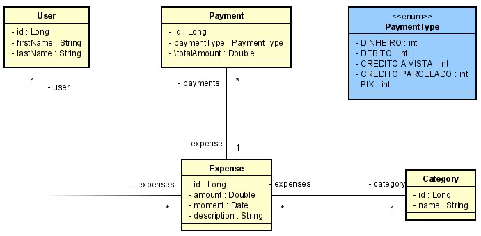

# Desafio Prático do Bootcamp DIO GFT Start #4 Java :coffee:

## Sobre o projeto

É uma api web construída durante o desafio GFT Start #4, evento organizado pela [DIO](https://www.dio.me/).

O projeto consiste basicamente no gerenciamento dos custos e despesas, ou seja, inicialmente formado por quatro classes e um enumeration, o usuário informa o valor financeiro do gasto, a categoria, uma descrição se necessário, e quais formas de pagamento.

Foram explorados alguns recursos do Spring Framework, por exemplo, a injeção de dependência por meio das annotations @Repository e @Service, que, por sua vez, implementam os padrões de projetos conhecidos, respectivamente, por Singleton e Strategy.

Obs: Pretendo futuramente evoluir esta idéia e construir um frontend para utilização real da api.

## Motivação

Com a chegada do meu segundo filho, as coisas estreitaram e exigiram ainda mais controle das finanças...kkk

## Tecnologias utilizadas
### Back end
- Java
- Spring Boot
- JPA / Hibernate
- Maven
- H2 Database

## Modelo conceitual

### Autor

Alan Pacheco

https://www.linkedin.com/in/alan-pacheco-3a9b30138